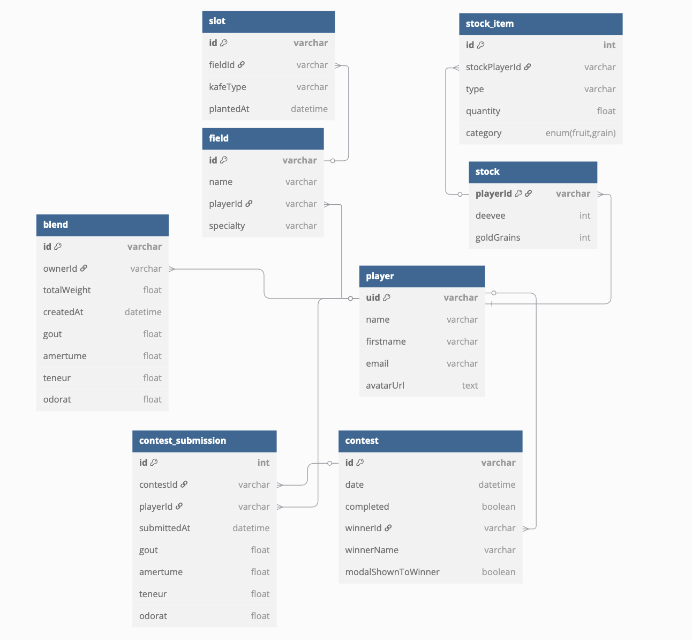
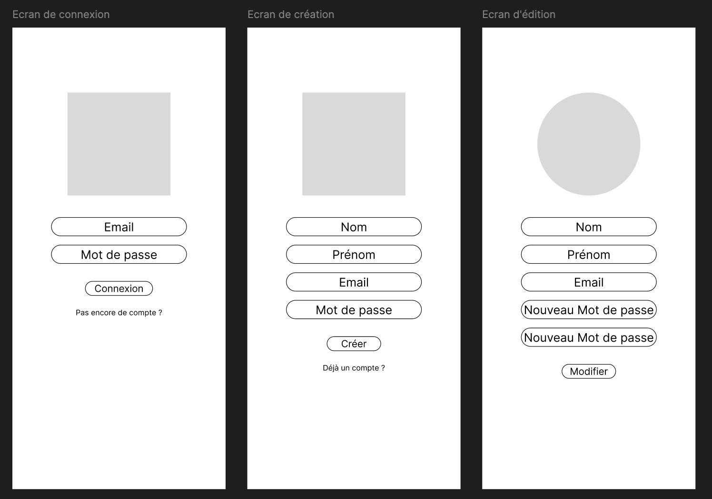
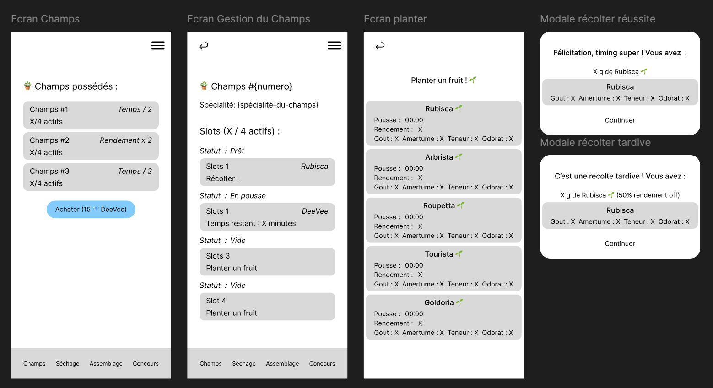
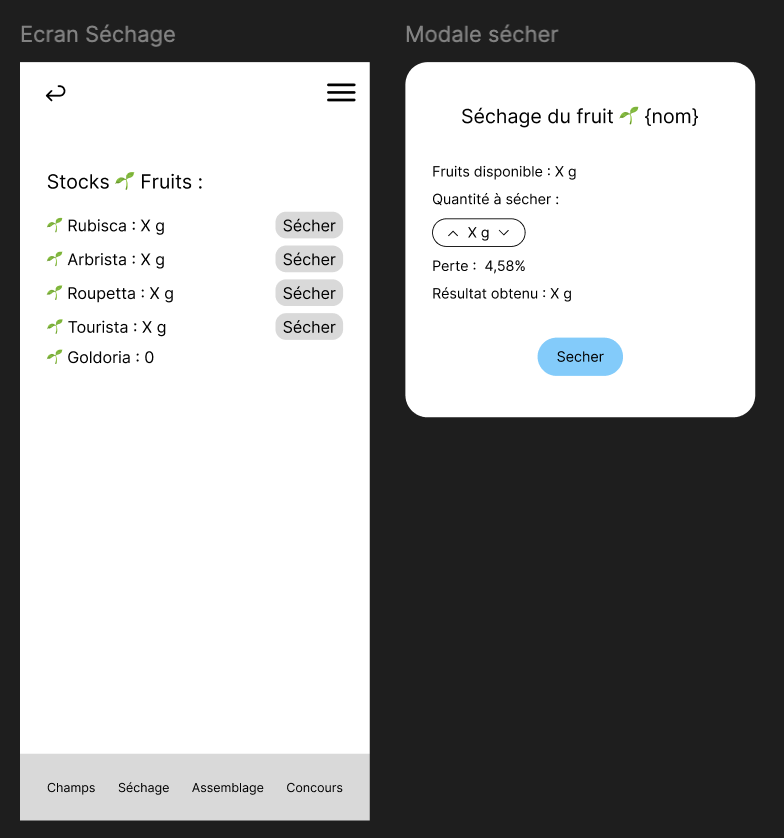
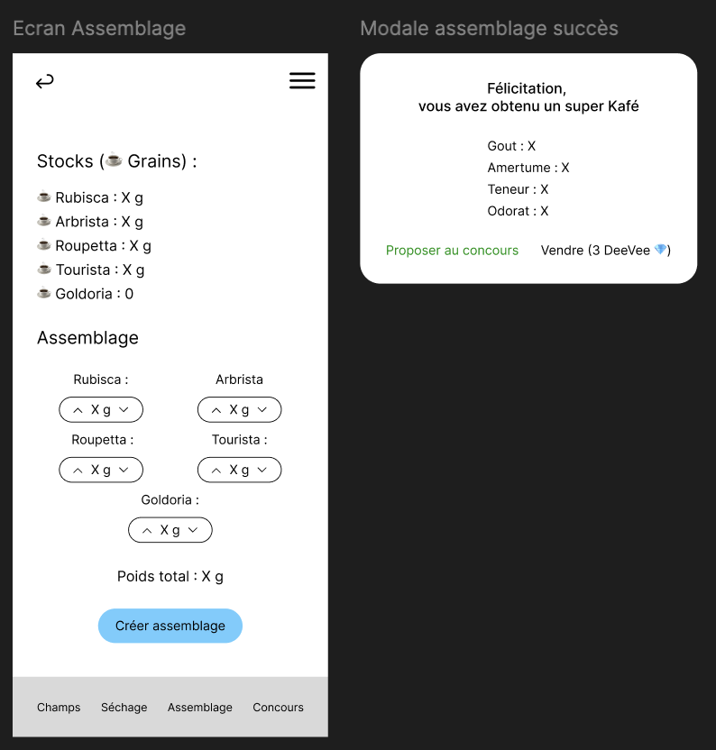

# 🌿 Kafé - Jeu de gestion agricole

## ✨ Mise en contexte
Ce projet a été réalisé dans le cadre de l'examen de fin de deuxième année du Bachelor Concepteur Développeur d'Application.

L'objectif était de concevoir une application mobile en une semaine, de gestion agricole centrée sur la culture de "Kafé", un produit fictif inspiré du café. Le joueur y gère des champs, plante des variétés de fruits, les fait sécher afin d'obtenir des grains, et assemble ces grains afin de former ces fameux "Kafé", qu'il peut alors faire participer à des concours afin de gagner des récompenses et le titre du meilleur torréfacteur.

Le sujet détaillé de l'examen se trouve ici :  
<a href="/ressources/sujet.pdf"> Le sujet </a>


## 🔄 Procédure de lancement

### Prérequis
- Flutter 3.x installé
- Un projet Firebase connecté avec les services suivants :
  - Authentication (email/mdp)
  - Firestore Database
  - Firebase Storage (optionnel pour l'avatar)

### Lancer le projet

```bash
git clone <ce_repo_url>
cd <repo>
flutter pub get
flutterfire configure # ou config manuelle
flutter run
```


## ⭐ Modèle de données & structure Firebase

### MCD relationnel
Un MCD relationnel ainsi qu'un script d'initialisation ont été conçus pour poser les bases de la logique de données de l'application. Il modélise les entités (joueur, champ, stock, blend, concours...) sous forme de tables reliées.

Visualisation :  


Initialisation SQL (MySQL) :  
<a href="/ressources/init_db.sql"> init_dq.sql </a>

### Adaptation Firebase / NoSQL
Afin de tirer meilleure partie de Firebase Firestore, ce modèle relationnel a été adapté en :
- Stockant chaque entité principale dans une **collection** (`players`, `fields`, `contests`)
- Utilisant des **sous-collections** pour les entités dépendantes (`contests/{id}/participants/{playerId}`)
- Dénormalisant certaines données (`slots[]` dans `Field`, `fruits[]`/`grains[]` dans `Stock`)

## 🎨 Maquette de l'application

L'application **Kaféiculteur** a été pensée autour d'une expérience utilisateur simple et immersive, centrée sur la gestion agricole (plantration et fruit) en suivant la progression horaire.

### Objectifs UX/UI
- Mettre en avant la progression du joueur via une interface claire (champs, stocks, monnaie)
- Faciliter l'interaction avec les actions clés (planter, récolter, assembler, participer)
- Donner du **feedback visuel immédiat** après chaque action (animations, mises à jour temps réel)


### 📱 Parcours utilisateur principal

| Écran              | Fonction                                                                 |
|--------------------|--------------------------------------------------------------------------|
| **Login/Register** | Connexion ou création de compte joueur                                  |
| **Account**        | Gestion du profil utilisateur et de l’avatar                            |
| **Game Home**      | Vue d’ensemble du du jeu |
| Section            | Fonction                                                                 |
|--------------------|--------------------------------------------------------------------------|
| **Fields**         | Liste des champs disponibles et leurs états                             |
| **Field Detail**   | Affichage des slots, plantation, récolte                                |
| **Drying**         | Visualisation des stocks et transformation des fruits en grains         |
| **Blend**          | Sélection des grains pour créer un Kafé  et calcul de stats             |
| **Contest**        | Soumission d’un Kafé et suivi du prochain concours                      |

---

### 🖼 Mockups

Ces mockups m'ont servi de base et de fil conducteur tout au long du cycle de développement de l'application. 

- **Page de gestion de l'utilisateur** : (<a href="./ressources/maquettes/maquette-compte.png">fichier source</a>)

- **Page de gestion des champs** : (<a href="./ressources/maquettes/maquette-champs.png">fichier source</a>)

- **Page de séchage** : (<a href="./ressources/maquettes/maquette-sechage.png">fichier source</a>)

- **Page d'assemblage : (<a href="./ressources/maquettes/maquette-assemblage.png">fichier source</a>)


## 🧠 Architecture & conception technique

### Structure logique
L’application suit un schéma clair et modulaire :
- **Game** : visuel, configuration et logique métier du jeu (`GameController`, `AuthGameController`)
- **Services** : gestion des appels Firebase (`StockService`, `ContestService`, etc.)
- **Providers** : gestion d’état avec `Provider` (`StockProvider`, `FieldProvider`...)

Chaque interaction suit une logique descendante :
```
UI ➝ Controller ➝ Service ➝ Provider (état)
```

### Gestion des concours et pop-up
Le système de concours est évalué de manière automatisée via un `ContestChecker`, affiché en permanence (invisible) dans le `MainApp`.

- Chaque minute, `ContestChecker` appelle `GameContest.checkAndRewardContest()`
- Cette méthode :
  - Évalue un concours si terminé mais non jugé
  - Attribue un gagnant, le récompense
  - Enregistre le résultat avec un flag `modalShownToWinner`
- Si le joueur est le gagnant **et** qu’il n’a pas encore vu le résultat, un **popup (modal)** s’affiche avec les détails du concours

Cette logique garantit :
- ✅ Une seule évaluation par concours
- ✅ Une expérience utilisateur fluide et non redondante
- ✅ Des récompenses distribuées uniquement au gagnant


## 📌 Fonctionnalités clés de l'app
- Authentification et gestion de compte
- Création et gestion de champs personnalisés
- Plantation avec timer de pousse
- Séchage et transformation en grains
- Assemblage de blends avec stats gustatives
- Concours horaires avec récompenses automatiques
- Monnaies virtuelles (DeeVee et Or)


## 🗂 Arborescence utile
- `/lib/models/` : structure des données principales
- `/lib/services/` : logique de persistance Firebase
- `/lib/providers/` : gestion d'état (via Provider)
- `/lib/screens/` : pages principales
- `/ressources/` : sujets, MCD, SQL

---

✉️ auteur du projet: François Kukla
